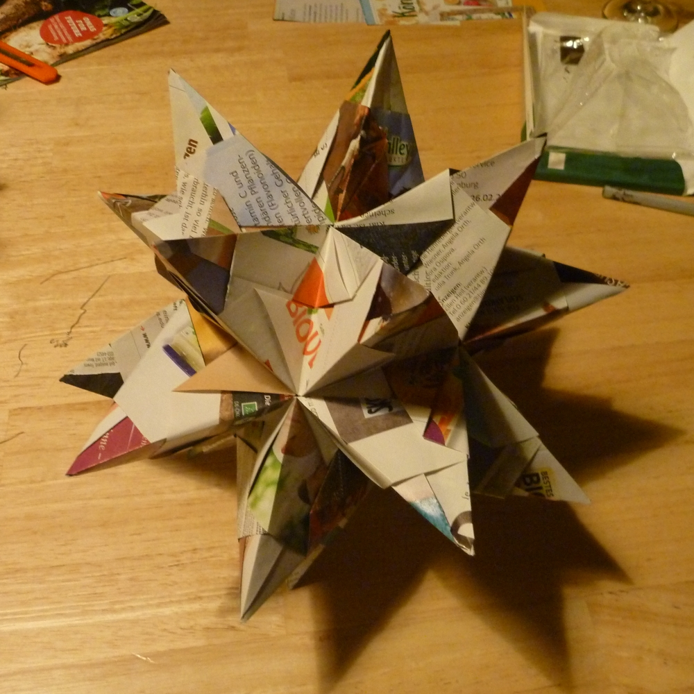

<!--lint disable list-item-indent-->
<!--lint disable list-item-bullet-indent-->

# folded paper star
folded Star

# TODO
- take photos of steps for folding...
- analyze visible areas
- create template & helper tool for mapping images onto visible areas

## research

---

## License
<!-- license info -->

 

    all files in folded_paper_star
 by
<a
    xmlns:cc="http://creativecommons.org/ns#"
    href="https://github.com/s-light/folded_paper_star"
    property="cc:attributionName"
    rel="cc:attributionURL">
    Stefan Krüger (s-light)
</a>
are licensed under a 
<a rel="license" href="http://creativecommons.org/licenses/by/4.0/">
    Creative Commons Attribution 4.0 International License
</a>.

all software parts/files are licensed under [MIT](LICENSE).
